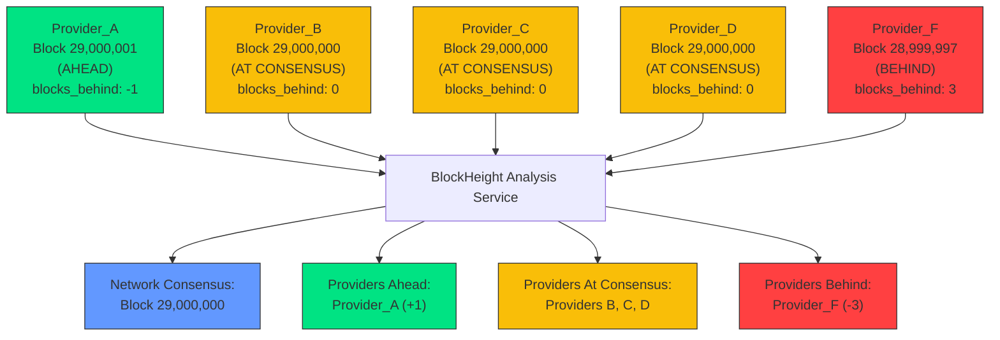

## Overview

At BlockHeight, we continuously track the performance and reliability of RPC node providers across major networks, surfacing real-time insights into block propagation and consensus lag. Developers use BlockHeight to identify which endpoints are ahead, in-sync, or falling behind—enabling intelligent routing, faster state access, and more resilient web3 infrastructure. In a world of distributed nodes, we create consensus about consensus.


## Core Problem

In blockchain networks, consensus is achieved at the protocol level through validators or sequencers that order and write transactions to the ledger. However, due to the distributed nature of the nodes, the actual RPC nodes developers rely on don't always update with the latest block height simultaneously.

This creates a critical reliability challenge: how do developers know which RPC providers are truly at the current block height? How can they ensure their applications are reading the most current state and writing transactions based on up-to-date information?

Even a slight delay of a few blocks can result in:

- Failed transactions
- Missed financialopportunities

This problem becomes exponentially more complex in load-balanced environments where traffic is distributed across multiple providers and endpoints.

## BlockHeight's Solution

BlockHeight creates a real-time "consensus about consensus" - continuously monitoring the block height reported by all major RPC providers to determine:

1. The current network consensus height
2. Which providers are ahead of consensus (seeing blocks first)
3. Which providers are at consensus (reliable current state)
4. Which providers are behind consensus (potentially stale data)

Through this intelligence layer, BlockHeight enables developers to make informed, real-time decisions about where to route their blockchain traffic for optimal application performance.

## How It Works: Real-World Example

Consider a scenario where a developer needs to submit a time-sensitive transaction based on the most current blockchain state:

```
Provider_A: Block 29,000,001
Provider_B: Block 29,000,000
Provider_C: Block 29,000,000
Provider_D: Block 29,000,000
Provider_F: Block 28,999,997
```

BlockHeight's service would analyze this data and determine:

- **Network Consensus: Block 29,000,000** (majority agreement)
- **Provider_A: AHEAD** (seeing new blocks faster than others)
- **Providers B, C, D: AT** (reliable current state)
- **Provider_F: BEHIND** (3 blocks behind, potentially stale)

